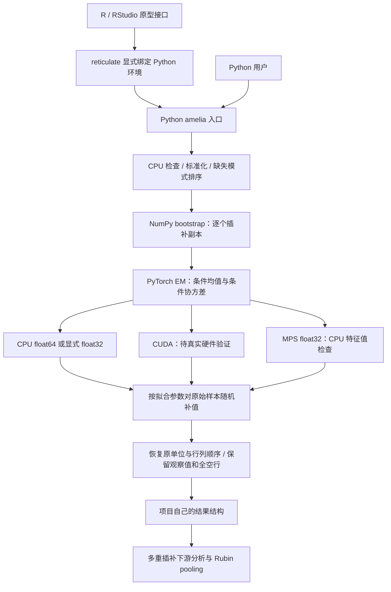

# 当前架构与下一阶段边界

目标是完整复现 Amelia 1.8.3 的公共流程；下图仅描述当前已实现的连续数值路径。功能状态以 [兼容矩阵](amelia-compatibility.md) 为准。

## 已实现的边界

- `src/amelia_torch/api.py` 负责当前公共连续路径，拒绝未知选项。每个 bootstrap 拟合得到的参数用于原始样本补值；不输出 bootstrap 样本来冒充原数据。
- `em.py` 在已准备的坐标上拟合，保留缺失条件协方差对充分统计量的贡献；`imputation.py` 接受显式标准正态输入，便于确定性跨语言核对。
- NumPy 负责随机输入、缺失模式准备和数据恢复。PyTorch 承担 EM/条件分布线性代数。当前各插补副本顺序执行，并非 GPU 全流程驻留或批处理实现。
- MPS 不支持 float64，且本版特征值诊断明确在 CPU 执行。报告必须把它称为混合路径；环境 fallback=0 本身不足以证明没有任何 CPU 工作。
- R 接口管理环境与数据转换，保留数字矩阵/数据框的名字；它不是完整 Amelia S3 API，也不假冒官方 `amelia` 类。native Python 返回 NumPy 数组和元数据；单独的 R 兼容桥接实现支持的 pandas 类型往返。

## 已确定的兼容路线

用户已确认 GPL-3.0-only、amelia-torch、维护者 Sheng Wan 及小样本＋完整下载脚本的数据方案；完整兼容验收后才算首版。允许明确标注的 R 过渡路径。R `amelia_compat` 直接委托原版，`amelia_torch_compat` 在私有闭包环境保留 R 预处理/bootstrap/抽样/后处理并替换 EM；Python 参考桥保留 typed 数据和完整 RDS。这些路径已有固定案例对照与下游方法测试，但完整边界仍在验收，不能仅凭委托官方代码即声称支持全部功能。

各条路径都要先完成原版边缘行为的测试，再开放相应选项。性能优化只能改变计算实现；不能为了更快而删掉 bootstrap、不确定性抽样、先验更新、收敛规则或原有转换步骤。

## 优化的证据顺序

先确认同样的模型与输出，再定位时间分配。当前可疑成本包括 CPU/GPU 传输、小矩阵调度、缺失模式数量和副本串行执行。批处理、缓存、保持张量驻留以及减小 R 桥接成本均属后续实验，不是已证明的提速手段。CPU 版本相对 R 的差异也可能来自 BLAS 和数据处理方式，不能一律归功于 GPU。

## Python/R 兼容桥

Python 的 `amelia_reference` / `amelia_torch_compat` 通过独立 Rscript 进程读写 typed 二进制列与小型 JSON 元数据，保留完整 RDS 结果，避免大矩阵通过 JSON 文本传送。后者将 `RETICULATE_PYTHON` 明确绑定到调用者解释器，再由 R 包调用 PyTorch EM。进程启动、文件传输和 Python 返回对象重建会增加开销；R 端混合基准不包含这些 Python→R 进程成本，不能直接作为该入口的速度。

R 兼容内核在私有闭包环境替换 `emarch`，不修改 Amelia 包的 namespace。类别、变换、时间结构、先验坐标、bootstrap、R RNG、条件抽样和输出结构仍运行原版代码。原版诊断函数在 CPU 上运行；有官方返回类并不表示所有诊断都使用 GPU。
