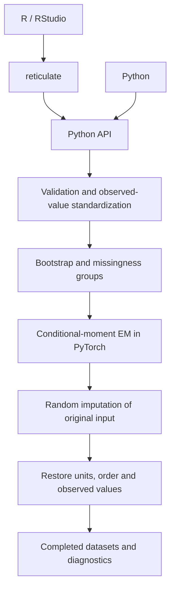

# Architecture

[简体中文](architecture.zh-CN.md) · [Documentation](README.md)

Three interfaces target Amelia 1.8.3 with different execution boundaries. [Compatibility](amelia-compatibility.md) specifies their validated scope.

| Route | Workflow | Output |
|---|---|---|
| Reference | Original R preprocessing, bootstrap, EM, draws and postprocessing | Official R object and RDS |
| Hybrid | Original R workflow; EM replaced through private function environments | Official R object with backend metadata |
| Native | NumPy preparation and RNG; PyTorch EM and conditional linear algebra | NumPy arrays and project diagnostics |

## Native pipeline

```mermaid
flowchart TD
    R[R / RStudio] --> RT[reticulate]
    RT --> API[Python API]
    PY[Python] --> API
    API --> PRE[Validation and observed-value standardization]
    PRE --> BOOT[Bootstrap and missingness groups]
    BOOT --> EM[Conditional-moment EM in PyTorch]
    EM --> DRAW[Random imputation of original input]
    DRAW --> POST[Restore units, order and observed values]
    POST --> RESULT[Completed datasets and diagnostics]
```

`api.py` controls the public continuous workflow; `em.py` retains conditional covariance in sufficient statistics; `imputation.py` accepts explicit normal draws for deterministic reference comparisons. Each bootstrap fit imputes the original input, not the resampled data. Replicates run sequentially. Unsupported model options raise errors.

NumPy supplies random inputs, missingness preparation and output reconstruction. CPU float64 is the numerical reference. CUDA supports explicit float64/float32; MPS requires float32 and performs eigenvalue diagnostics on CPU. No route is described as wholly GPU-resident. Fixed CUDA cases and performance runs exist on Linux T4 and Windows RTX 3080; inference acceptance remains incomplete.

## Python/R exchange

Python reference/hybrid calls launch a separate Rscript process. Typed binary columns and small JSON metadata avoid sending large matrices as JSON text. The full RDS object is retained. Hybrid calls bind `RETICULATE_PYTHON` to the caller's interpreter; R then calls the Torch EM backend. Process startup, file exchange and Python reconstruction are additional costs not included in R-side hybrid timings.

The R hybrid changes private lookup environments, not the Amelia namespace. Categories, transformations, panel structure, prior coordinates, bootstrap, R RNG, conditional draws and downstream diagnostics remain original R CPU work. Registered C helpers preserve both the internal R RNG and the visible `.Random.seed`, plus the documented explicit-double-start-value mutation.

## Optimization boundaries

Changes may improve computation, but must preserve preprocessing, bootstrap, uncertainty, priors, stopping rules and RNG behavior. Transfers, small-matrix dispatch, missingness patterns and serial replicate scheduling are profiling candidates, not established explanations of measured differences. Batching, caching and device residency remain proposed optimizations. CPU gains over R also include implementation and numerical-library differences.
