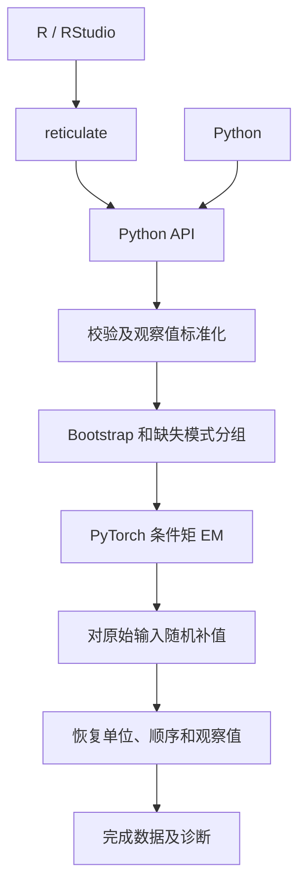

# 架构

[English](architecture.md) · [文档目录](README.zh-CN.md)

三条接口路线面向 Amelia 1.8.3，计算边界不同。已验证范围见[兼容表](amelia-compatibility.zh-CN.md)。

| 路线 | 流程 | 输出 |
|---|---|---|
| 原版参考 | 原版 R 预处理、bootstrap、EM、抽样和后处理 | 官方 R 对象及 RDS |
| 混合兼容 | 保留原版 R 流程，在私有函数环境中替换 EM | 带后端元数据的官方 R 对象 |
| 原生连续 | NumPy 预处理和随机数；PyTorch EM 及条件分布线性代数 | NumPy 数组及项目诊断 |

## 原生流程

`api.py` 控制连续数据公共流程；`em.py` 将条件协方差保留在充分统计量中；`imputation.py` 接受显式正态随机输入，用于确定性原版对照。每个 bootstrap 拟合均用于原始输入的补值，不输出重抽样数据。插补副本顺序执行，不支持的模型选项明确报错。

NumPy 提供随机输入、缺失模式准备及输出重建。CPU float64 是数值参考。CUDA 可显式选择 float64/float32；MPS 要求 float32，特征值诊断在 CPU 上执行。各路线均不宣称全流程驻留 GPU。Linux T4 和 Windows RTX 3080 已有固定 CUDA 案例与性能记录，推断验收尚未完成。

## Python/R 数据交换

Python 原版/混合入口启动独立 Rscript 进程。保留类型的二进制列与小型 JSON 元数据避免用 JSON 文本传输大矩阵，并保留完整 RDS。混合入口将 `RETICULATE_PYTHON` 绑定到调用方解释器，再由 R 调用 Torch EM。进程启动、文件交换及 Python 输出重建带来额外成本，不包含在 R 端混合计时中。

R 混合路线修改私有查找环境，不修改 Amelia namespace。类别、变换、面板结构、先验坐标、bootstrap、R RNG、条件抽样及下游诊断仍由原版 R CPU 执行。注册 C helper 保留 R 内部随机状态、可见 `.Random.seed`，以及已记录的显式 double 初值原位更新语义。

## 优化边界

优化可改变计算实现，但须保留预处理、bootstrap、不确定性、先验、停止规则与 RNG 行为。传输、小矩阵调度、缺失模式及副本串行调度是待剖析的成本，尚不能确定解释实测差异。批处理、缓存和设备驻留仍是待验证方案。相对 R 的 CPU 收益也包含实现和数值库差异。
