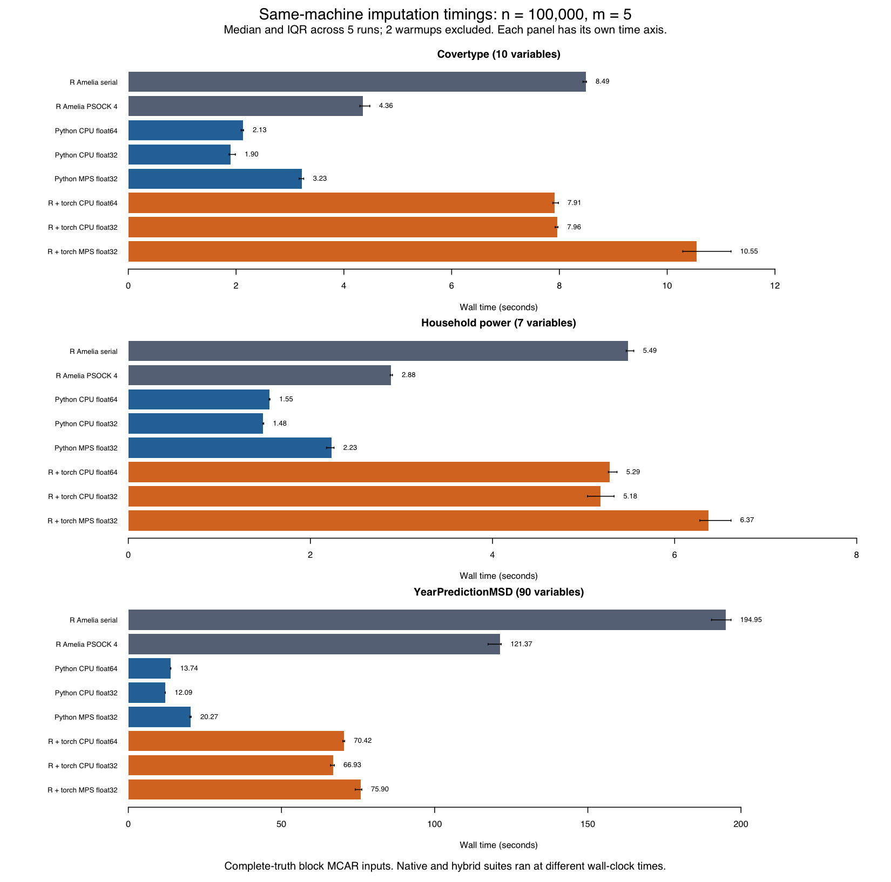
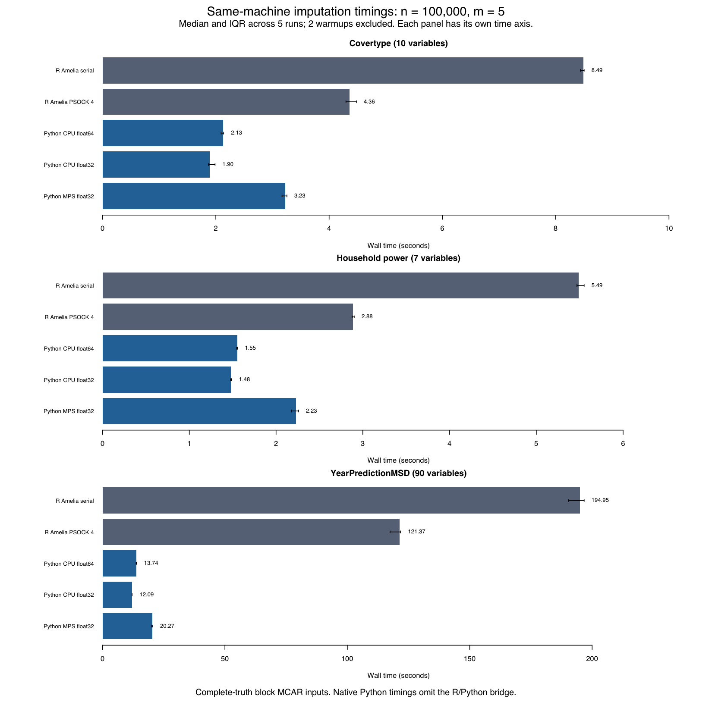

# 开发验证记录（2026-09-23）

这是开发快照的实测记录，**不是首版验收报告**。完整 Amelia 1.8.3 兼容、完整 CUDA 验收、平台边界与较复杂缺失模式仍需验证。所有数字只说明指定任务和机器上的结果。

## 本机与实验任务

Apple M4、8 CPU/8 GPU 核心、16 GB RAM；macOS 26.6.2，Python 3.12.13、PyTorch 2.14.0、NumPy 2.5.3、R 4.5.3、Amelia 1.8.3。CPU float64 为默认数值参考；MPS 仅显式 float32，特征值诊断明确回到 CPU。

三个 UCI 数据集各取 100,000 行完整数值子集，使用相同的人工块状 MCAR 输入：Covertype 10 列、Household Power 7 列、Year Prediction MSD 90 列。实际缺失率分别为 30%、28.571%、30%，缺失模式数为 8、7、8。每次生成 5 份插补，2 次预热后重复 5 次计时，EM tolerance=1e-4，最多 300 轮。数据来源、完整数据规模和抽样限制见[数据说明](../../datasets.zh-CN.md)。

## R 用户混合接口端到端耗时

`ameliatorch::amelia_torch_compat()` 保留原版 R 的预处理、bootstrap、随机补值和后处理，只把 EM 交给 PyTorch。以下为完整 R 用户调用的中位数，单位为秒，包含 R/reticulate 转换和设备传输：

| 数据集 | 原版 R 串行 | 原版 R snow ×4 | R + Torch CPU64 | R + Torch CPU32 | R + Torch MPS32 |
|---|---:|---:|---:|---:|---:|
| Covertype | 8.489 | 4.357 | 7.909 | 7.960 | 10.550 |
| Household Power | 5.490 | 2.885 | 5.288 | 5.185 | 6.374 |
| Year Prediction MSD | 194.947 | 121.373 | 70.422 | 66.934 | 75.901 |

**R 产品接口的收益明显小于 native Python 表格所显示的差距。** 默认 CPU64 在 90 变量任务上的记录中位数约为原版 R 串行的 1/2.77、四进程的 1/1.72；两组低维任务与串行 R 接近，并慢于原版 R 四进程。低维中位数约 4%–7% 的差别不能单凭这次分批测量推广为稳定提速。MPS32 比相同精度的混合 CPU32 慢约 13%–33%，本次没有得到 MPS 自身带来端到端加速的证据。

全部 9 个配置、63 次调用（315 份插补，包括预热）通过独立审计：完整计划和顺序、每次请求的 seed/m、退出码 0、进程期间源码未改变、所请求后端和每份插补收敛、观察值保持、全部 heldout 有限并参与计分、无意外非有限值。初次 Python 导入、解释器绑定、CSV 读取、评分和进程冷启动在计时外；原版 R 工作和桥接转换在计时内。GPU 计时前后同步，MPS 特征值检查在 CPU 明确执行。

- [混合接口独立审计、中位数/IQR与哈希](hybrid-summary.json)
- [原始逐次报告与任务清单](hybrid-reports/suite.json)，不包含本地配置或私人路径
- [实际混合测量源码快照](hybrid-measured-source.zip)：已核对其全部源文件与 suite SHA-256 一致
- [与原版 R 的配对汇总比较](hybrid-reference-comparison.json)

两套实验在同一机器的不同时间段、不同源码版本下运行，未完全隔离后台负载，也没有测量峰值 RAM/VRAM。因此表中比值是记录中位数的描述性比较，不能归因于 GPU，也不代表所有机器、BLAS 或缺失结构。此处还不包含 Python→Rscript 入口的进程和文件传输成本。

另有[矢量 PDF](combined-timings.pdf)与[图表文件/输入校验记录](combined-timings-metadata.json)。图中每个数据集使用独立时间轴，误差线为 5 次正式测量的 IQR。

## 相同 R 随机数设置下的汇总对照

比较器按 `phase + seed` 对齐全部预热和正式运行，检查 R 版本、`L'Ecuyer-CMRG / Inversion / Rejection`、相关 R 包版本、线程设置、Amelia 参数和准备 NPZ 指纹。混合路径记录复用主实验 CSV，并保存 input/truth/mask 的 SHA-256；旧主实验没有保留当时逐 CSV 指纹，这项历史证据限制不能事后补造。native Python 使用 NumPy PCG64，不纳入这个配对。

CPU64 的 105 份配对插补记录中，EM 迭代次数全部一致。下面是各数据集跨全部 7 次调用的最大绝对差，数值保持原始单位：

| 数据集 | pooled 列均值 | 平均样本协方差元素 | 逐份标准化 RMSE |
|---|---:|---:|---:|
| Covertype | 1.00e-11 | 1.00e-8 | 9.99e-15 |
| Household Power | 4.82e-12 | 9.46e-10 | 1.80e-11 |
| Year Prediction MSD | 1.02e-12 | 1.05e-9 | 0（保存的 JSON 精度内） |

float32 虽然通过收敛、有限性与观察值保持等基本质量门槛，仍有可见数值差异：

| 数据集 | EM 后端 | 最大迭代数差 | 最大标准化 RMSE 绝对差 | 最大协方差逐项相对差 |
|---|---|---:|---:|---:|
| Covertype | CPU32 | 8 | 1.82e-4 | 2.64% |
| Covertype | MPS32 | 1 | 5.43e-6 | 0.208% |
| Household Power | CPU32 | 1 | 4.94e-5 | 0.0592% |
| Household Power | MPS32 | 1 | 2.83e-5 | 0.0502% |
| Year Prediction MSD | CPU32 | 1 | 4.94e-5 | 38.4% |
| Year Prediction MSD | MPS32 | 0 | 9.45e-8 | 0.456% |

相对差按 `abs(hybrid-reference)/abs(reference)` 计算，仅对原值绝对值大于 1e-12 的元素定义；接近零的分母仍可能放大百分比。Year 的 CPU32 最大 38.4% 来自第 50/85 列协方差：原版约 −0.01000264、混合约 −0.00616254，绝对差约 0.00384010（正式 seed=20260923）。这不是整张协方差矩阵相差 38.4%，也不能忽略这项实际差异。完整逐次绝对/相对差、Rubin 列均值方差及源码差异保存在配对 JSON 中。

本对照没有预设数值等价阈值，也未保存全部完成矩阵和逐次 RNG draw；匹配的 seed 不能单独证明随机消耗完全相同。均值、协方差与 RMSE 接近，不足以证明逐格、逐位或完整分布等价。CPU64 保持默认，float32 继续作为显式选择的实验路线。

## Native Python 端到端耗时

单位为秒，表内为 5 次正式测量的中位数。

| 数据集 | 原版 R 串行 | 原版 R snow ×4 | Torch CPU64 | Torch CPU32 | Torch MPS32 |
|---|---:|---:|---:|---:|---:|
| Covertype | 8.489 | 4.357 | 2.126 | 1.895 | 3.225 |
| Household Power | 5.490 | 2.885 | 1.552 | 1.478 | 2.232 |
| Year Prediction MSD | 194.947 | 121.373 | 13.744 | 12.089 | 20.267 |

**本次 MPS 比同机 Torch CPU64 慢约 44%–52%，比 Torch CPU32 慢约 51%–70%。** Torch CPU64 相对这台机器的 R 串行约快 3.5–14.2 倍，相对 R 四进程约快 1.9–8.8 倍。这是实现、数值库和执行方式的综合差异，不能归因于 GPU，也不能推广到使用其他 BLAS 的 R 安装。未开展瓶颈剖析，不能把猜测当作慢速原因。

全部 105 次调用（525 份插补，包括预热）经过独立质量审计：收敛、观察值保持、人工遮盖位置全部有限并参与计分、无剩余缺失/非有限值。RMSE 接近不构成分布等价证明。R 与 NumPy 使用不同随机数库，同 seed 不代表同一 bootstrap。

- [加强后的独立质量审计、中位数/IQR与哈希](benchmark-summary-audit-v2.json)；保留[首轮汇总](benchmark-summary.json)以追溯旧格式。加强审计确认全部计划任务、每份插补、种子顺序、退出码和有限正耗时，15/15 配置仍通过。
- [逐次报告和测量配置](benchmark-reports/suite.json)
- [当时实际测量的源码快照](measured-source.zip)：与汇总中源文件 SHA-256 核对。实验后新增了溢出拒绝、更严格失败计分、只读数组兼容和 fractional emburn 处理；当前开发源码因此可能不与旧测量哈希相同。旧结果由独立汇总器审计，不用后改源码冒充当时版本。

计时包含标准化、bootstrap、EM、条件随机补值、设备传输和恢复 CPU 输出；排除文件读取、进程冷启动、评分和保存。R snow 包含 worker 创建/销毁。Torch 和 R 串行设置 4 CPU 线程，R snow 为 4 worker ×1 线程；环境变量不保证所有 BLAS 都采用相同线程策略。没有峰值 RAM/VRAM 或后台负载观测，也未完全隔离操作系统其他工作。不同方法在固定随机顺序中依次执行。

本表是原生 Python 路线，R→Python 产品接口须使用前面的独立混合计时。

图表可由 `scripts/plot_benchmarks.R` 从审计 JSON 重建；另有[矢量 PDF](native-timings.pdf)。

## 正确性与推断质量

- 原版 R 导出的固定 EM、显式随机补值、公共连续接口 fixture 用于确定性语义对照，覆盖初值、样本协方差、先验、停止规则、尺度和行列恢复。原版会原位改变 theta；导出器先复制输入。
- [MPS 内核报告](mps-kernel-validation.json)：无先验、经验先验和 cell prior 三个固定案例通过；使用匹配容差对照 CPU64，并用原版显式标准正态对照随机补值。它不是完整统计等价检验。
- [R 用户 MPS 接口报告](mps-r-interface-validation.json)：变换、类别、先验/边界三个固定案例，保留原版 R 随机流，只用 GPU 替换 EM。预先设置的门槛全部通过，最大标准化连续输出误差小于 2.2e-7，离散输出无差异。
- [400 次推断模拟及逐次记录](inference-validation.zh-CN.md)：指定联合正态模型下，MCAR/MAR 各 200 次独立数据、每次 5 份插补，共 2,000 次 EM 全部收敛。CPU64 的 OLS 系数偏差分别 −0.000688、0.002905；Rubin pooled 95% 区间覆盖率为 96%、97%，覆盖率 Monte Carlo 标准误为 1.39、1.21 个百分点。只适用于本实验模型，不是任意模型或 GPU 的覆盖率保证。
- [本地检查汇总](local-checks.json)：128 项 Python 全套测试通过；wheel 在源码目录之外完成 native/reference/hybrid 三入口运行；5 个 R 测试文件通过，最终含注册 C RNG helper 的 R CMD check 零问题。
- [Python 原版 R 桥接验证](python-reference-bridge.json)与 [R 包检查](r-package-check.md)。原版 Amelia 1.8.3 的单行 priors 索引特例可能改动无关观察值，详见[算法契约](../../algorithm-contract.md)；兼容路径保留并说明此行为。
- [RNG 互操作回归](python-hybrid-rng.json)：`boot.type="none"` 多份插补曾因 reticulate 重新装载旧 `.Random.seed` 而重复。注册 C helper 同时保护内部状态和可见 R 变量，修复后通过插补结果、结束状态和后续 `runif/rnorm` 对照，包含 Inversion 与 Box–Muller。没有改变 bootstrap 或抽样算法。
- [R 下游验证](r-downstream-validation.md)：摘要、图形诊断、pooling、CSV、arglist、追加、moPrep 和 allthetas。图形/诊断继续使用原版 R CPU。

## 尚未验收

完整 CUDA 性能与统计验收、Intel Mac 安装、全部原版参数组合/异常/下游工作流、独立逐格 MCAR 的性能压力、全量行数实验及峰值内存测量。设备探针和跨操作系统 CPU CI 不能替代完整 CUDA 结果。不会因为 native CPU 变快或局部测试通过就称“完整复现”或“GPU 已加速”。
