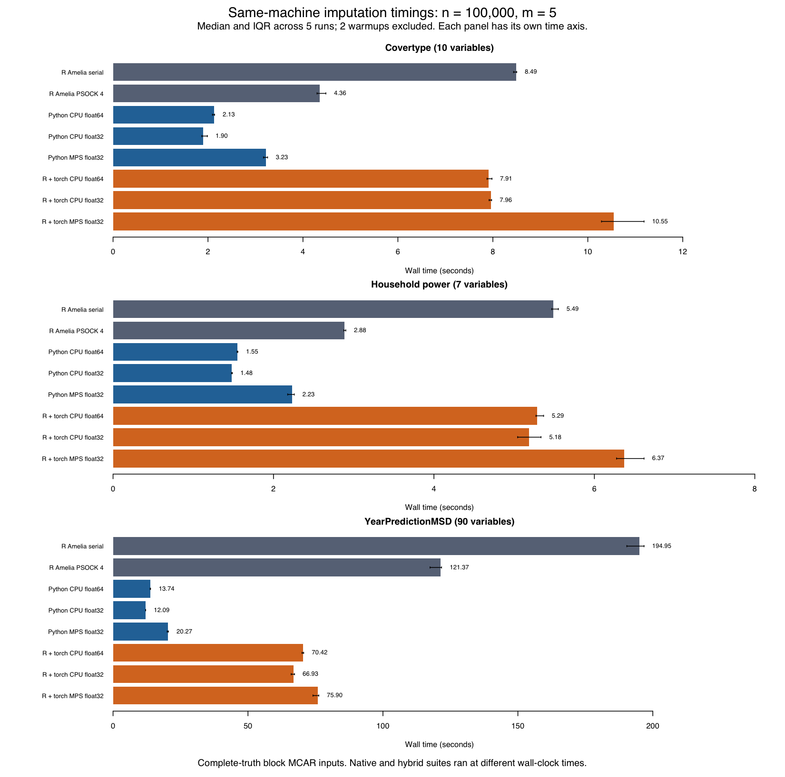

# Mac development validation

[简体中文](README.zh-CN.md) · [Documentation](../../README.md)

Measured development results on M4,8 CPU/8 GPU cores, 16 GB, Mac 26.6.2, Python 3.12.13/Torch 2.14.0/NumPy 2.5.3/R 4.5.3/Amelia 1.8.3. This is not a complete-release report. CPU64 is default; MPS32 is explicit with CPU eigenvalue diagnostics.

## Timings

Each UCI numeric subset has 100,000 complete-source rows, 10/7/90 columns, blockMCAR30/28.571/30%, 8/7/8 patterns, m=5, two warmups/five measured repetitions, tolerance 1e−4, max 300 iterations. Values below are median seconds; IQR and all repeats are in JSON.

| Dataset | R serial | R snow4 | Native CPU64 | Native CPU32 | Native MPS32 | Hybrid CPU64 | Hybrid CPU32 | Hybrid MPS32 |
|---|---:|---:|---:|---:|---:|---:|---:|---:|
| Covertype |8.489|4.357|2.126|1.895|3.225|7.909|7.960|10.550|
| Household Power |5.490|2.885|1.552|1.478|2.232|5.288|5.185|6.374|
| Year Prediction MSD |194.947|121.373|13.744|12.089|20.267|70.422|66.934|75.901|

Native MPS32 was 51–70% slower than CPU32; hybrid MPS32 was 13–33% slower than hybrid CPU32. Hybrid CPU64 on Year was 2.77× faster than serial R and 1.72× faster than snow4; narrow-input results were near serial R and slower than snow4. Native/R differences combine implementation, numerical libraries, RNG and workflow scope, not solely GPU. No profiling isolates causes.

Native 15 configurations/105 calls/525 imputations and hybrid 9/63/315 passed their independent convergence, observation, finite-output and complete-heldout audits, including warmups. Native audit-v2 additionally verified expected plan, seeds, exits and positive timings; the initial summary remains. Source ZIP files match measured hashes; later input/error-handling fixes are not retroactively assigned to these runs.

Full native calls include preparation, bootstrap, EM, draws, transfers and CPU reconstruction. R hybrid includes original R work and reticulate conversion. File reads, cold process startup/import/binding, scoring and output writing are excluded; snow worker setup/teardown is included. Torch/R serial request 4 threads; snow4 workers×1BLAS thread. Environment settings do not prove actual utilization. The suites ran in separate batches/revisions with unisolated background load and unmeasured peak RAM/VRAM. Python→Rscript startup/file exchange is not included.

## Paired R summaries

All warmups/measured calls align by phase/seed and R versions, RNGkind(L'Ecuyer-CMRG/Inversion/Rejection), packages, threads, parameters and prepared NPZ identity. Hybrid retained reused CSV hashes; the earlier reference suite did not record simultaneous per-CSV hashes. NativePCG64 is excluded from this R pairing.

CPU64 matched 105 iteration counts. Maximum pooled-mean/covariance/normalizedRMSE differences respectively: Covertype 1.00e−11/1.00e−8/9.99e−15; Household 4.82e−12/9.46e−10/1.80e−11; Year 1.02e−12/1.05e−9/0 at stored precision.

| Dataset / backend | Maximum iteration difference | Max normalizedRMSE difference | Max covariance relative difference |
|---|---:|---:|---:|
| Covertype CPU32 |8|1.82e−4|2.64%|
| Covertype MPS32 |1|5.43e−6|.208%|
| Household CPU32 |1|4.94e−5|.0592%|
| Household MPS32 |1|2.83e−5|.0502%|
| Year CPU32 |1|4.94e−5|38.4%|
| Year MPS32 |0|9.45e−8|.456%|

Relative differences divide by absolute reference entries>1e−12; small denominators can amplify them. Year's 38.4% concerns covariance 50/85 at seed 20260923,−.01000264 versus−.00616254, absolute difference 0.00384010—not the entire matrix. No equivalence threshold or full completed matrices/random draws were retained; summaries do not prove elementwise or distributional equality.

## Correctness and inference

R fixtures cover conditional moments, initialization, priors, stopping, scaling/order and explicit random inputs, with deep-copied theta. Three MPS kernel cases and three R MPS transformed/category/prior-bounds cases passed fixed limits; R maximum standardized error<2.2e−7, discrete differences 0.

The initial native CPU64 inference screen completed 400 datasets/2,000 fits: MCAR/MAR coverage 96/97%, bias−.000688/.002905, coverage MCSE 1.39/1.21 percentage points. This specified-model screen is not GPU acceptance. Later frozen G5 results are separate.

The local historical check batch had 128 Python passes, wheel calls outside the checkout, five R files and R CMD check 0 errors/warnings/notes. RNG regression fixed repeated boot.none draws by preserving both internal R and visible seed; Inversion/Box–Muller and later draws passed. Official downstream methods remain R CPU. Subsequent platform/GPU records must be read separately; full source datasets, broad missingness and total memory limits are not established here.

## Records

This report describes the dated run and measured source below. Later project status is recorded in the [evidence summary](../2026-09-27-evidence-summary.md).

[hybrid-summary.json](hybrid-summary.json) · [suite.json](hybrid-reports/suite.json) · [hybrid-measured-source.zip](hybrid-measured-source.zip) · [hybrid-reference-comparison.json](hybrid-reference-comparison.json) · [combined-timings.png](combined-timings.png) · [combined-timings.pdf](combined-timings.pdf) · [combined-timings-metadata.json](combined-timings-metadata.json) · [benchmark-summary-audit-v2.json](benchmark-summary-audit-v2.json) · [benchmark-summary.json](benchmark-summary.json) · [suite.json](benchmark-reports/suite.json) · [measured-source.zip](measured-source.zip) · [native-timings.png](native-timings.png) · [native-timings.pdf](native-timings.pdf) · [mps-kernel-validation.json](mps-kernel-validation.json) · [mps-r-interface-validation.json](mps-r-interface-validation.json) · [local-checks.json](local-checks.json) · [python-reference-bridge.json](python-reference-bridge.json) · [python-hybrid-rng.json](python-hybrid-rng.json)
