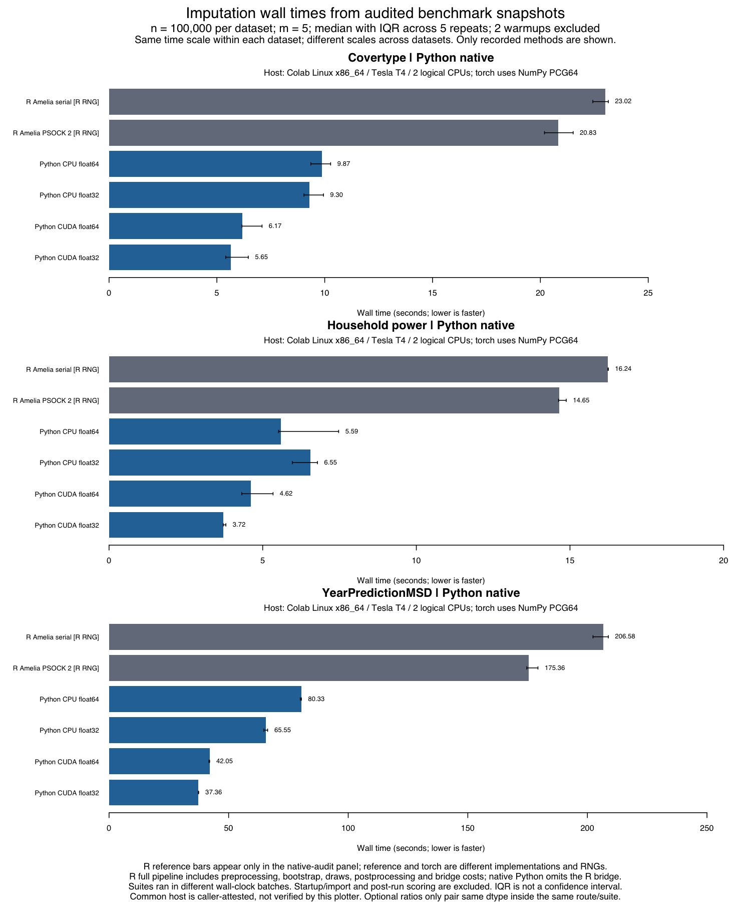

# Colab T4：三组公开数据的 native 主基准

2026-09-26，在同一台 Colab Linux/Tesla T4 运行时，三组各 100,000 行连续数据完成原版 R 串行、R snow2、Python CPU64/CPU32 与 CUDA64/CUDA32 的全部对照。**18 个配置、126 次调用、630 份插补均完成且通过本次有限的收敛与完整评分检查。** CUDA 相对同精度 Python CPU 的中位数速度比为 **1.212–1.910 倍**。这是低模式数、块状 MCAR 的 native 路线结果，不是完整 R hybrid 产品、统计推断质量或 Windows/RTX 3080 验收。

## 耗时

下表单位为秒，每格是 **5 次正式调用的中位数**，每次 `m=5`；各配置另有 2 次相同 API 预热，不纳入该中位数。IQR 和全部 7 次原始耗时均保留；IQR 是重复之间的离散程度，**不是置信区间**。没有删去失败后再选成功子集，本套件没有记录失败调用。

| 数据 | R 串行 | R snow2 | Python CPU64 | Python CPU32 | CUDA64 | CUDA32 |
|---|---:|---:|---:|---:|---:|---:|
| Covertype | 23.016 | 20.827 | 9.870 | 9.296 | 6.172 | 5.650 |
| Household power | 16.239 | 14.649 | 5.592 | 6.553 | 4.616 | 3.724 |
| YearPredictionMSD | 206.580 | 175.359 | 80.326 | 65.550 | 42.049 | 37.364 |

只在同一个 native 路线、同一精度、同一主机内计算 `CPU 中位数 / CUDA 中位数`，大于 1 表示 CUDA 路线耗时更短：

| 数据 | float64 速度比 | float32 速度比 |
|---|---:|---:|
| Covertype | 1.599× | 1.645× |
| Household power | 1.212× | 1.760× |
| YearPredictionMSD | 1.910× | 1.754× |

原版 R 对照可回答这台机器上的整体用户计算耗时，但它包含实现、BLAS、数据布局、随机流及设备差异，**不能把相对 R 的全部差值归因于 GPU**。原版使用 R L'Ecuyer-CMRG，native 使用 NumPy PCG64；相同种子不配对 R 和 NumPy 的随机抽样。两种 dtype 分别比较，不把 float32 与 CPU64 的混合差异写成纯 GPU 加速。



可下载 [矢量 PDF](native-timings.pdf)、[完整绘图数据](native-timings-plotted-data.csv) 与 [绘图来源/比值](native-timings-metadata.json)。图由已审计 JSON 离线绘制，没有重新拟合。绘图工具的“same host”是调用者基于本次连续云端会话和日志作出的声明，不是工具凭空验证机器身份；没有公开主机 UUID 或 hostname。

## 输入和计时边界

| 数据 | 本次行×列 | 已核验原始行数 | 可抽样完整行 | 人工缺失单元格 | 实际缺失率 | 模式数 |
|---|---:|---:|---:|---:|---:|---:|
| Covertype | 100,000×10 | 581,012 | 581,012 | 300,000 | 30.00% | 8 |
| Household power | 100,000×7 | 2,075,259 | 2,049,280 | 200,000 | 28.57% | 7 |
| YearPredictionMSD | 100,000×90 | 515,345 | 515,345 | 2,700,000 | 30.00% | 8 |

从完整来源行中以固定 seed 20260923 随机抽取 100,000 行，然后用 seed 20260924 增加块状 MCAR。Household power 在抽样前排除 25,979 条自然缺失行；列块离散化使实际人工缺失率为 2/7，而非恰好 30%。三个任务均无自然缺失残留、全空行或漏评 heldout。本实验**不是全量数据，也不是逐格独立 MCAR 或 MAR**；窄矩阵、少模式的结论不能外推到高维逐格缺失。

所有配置使用 tolerance `1e-4`、最大 300 轮、`autopri=0.05`、默认无经验先验、ordinary bootstrap。正式种子为 20260923–20260927，预热种子为 20360923–20360924。方法按数据集用固定随机顺序串行执行，记录顺序可从固定版本 runner 重建并与实际顺序逐条一致。

native 计时从内存输入开始，到全部 CPU NumPy 完成数据返回，包含预处理、bootstrap、EM、随机补值和设备传输，前后同步 CUDA。原版 R 从内存数据开始，到完整 Amelia 结果返回；snow 每次内部建群/销毁均计入。两者均不含解释器启动、依赖导入、数据读取或事后评分/JSON 写盘。native 不经过 R/Python 桥；R hybrid 必须看其独立套件，不能拼接为本表的一条新路线。

## 主机、预算及内存

实际环境：Linux x86_64（kernel 6.6.122+）、Intel Xeon 2.00 GHz，2 个可见逻辑 CPU 且 affinity 为 2；总内存记录为 13,286,944 KiB。GPU 是 **Tesla T4**，驱动 580.82.07，Torch 报告可见显存 15,637,086,208 bytes，`nvidia-smi` 报告物理容量 15,360 MiB，二者原样保留。Python 3.12.13、Torch 2.10.0+cu128、CUDA runtime 12.8、NumPy 2.0.2、R 4.5.3、Amelia **1.8.3**；TF32 关闭。详见 [环境摘要](environment-summary.json) 和压缩档中的完整版本记录。

计时预算是 serial/native/GPU host **2 线程**，snow **2 worker，各 BLAS 限制为 1 线程**。这是配置上限，不声称每种 BLAS 实际持续占满线程。bootstrap 的旧环境建议为 4 线程、算子探针记录为 1 线程；在任何正式基准前根据实际双核环境调整，见 [source-transition.json](source-transition.json)。每个实际计时报告中的线程配置都已核验，不能误用早期 setup 值。

每次 CUDA 调用先 reset 峰值计数，记录 `torch.cuda.max_memory_allocated`。下表取各配置全部 7 次调用（含预热）的最大值：

| 数据 | CUDA64 最大分配 bytes | CUDA32 最大分配 bytes |
|---|---:|---:|
| Covertype | 43,655,680 (41.63 MiB) | 26,947,584 (25.70 MiB) |
| Household power | 33,933,312 (32.36 MiB) | 21,924,864 (20.91 MiB) |
| YearPredictionMSD | 319,183,360 (304.40 MiB) | 165,269,504 (157.61 MiB) |

这是 **Torch 活跃张量的峰分配量**，不是总 GPU 进程峰值、CUDA context、缓存保留量或宿主 RAM。宿主峰值 RAM 和总进程 VRAM 没有测量，均保持 `null`，不能填 0。没有记录 OOM；这不等于已测试设备容量极限。初始化和缺失模式分组等 CPU 工作仍存在并在 native 诊断中明确记录，不称整个流程为纯 GPU。

## 质量与异常记录

独立审计覆盖 36 次预热 + 90 次正式调用，即 180 + 450 份插补；其中原版 R 210 份、native 420 份。所有实际报告均保存：收敛、观察值保留、有限完整输出、全部 heldout 评分，以及每份迭代次数。native 420 份的伪逆使用计数均为 0，最终经验先验均为 0；原版 R 未提供这些低层计数，不能把其缺失字段补成 0。原版 R 的 42 次调用 warning 列表均为空；native 没有独立逐调用 warning 列表，stdout/stderr 日志完整保留。

标准化 heldout RMSE 的方法均值约为 Covertype 1.058、Household power 0.999、YearPredictionMSD 1.085，逐份值在原报告，精确摘要见 [独立审计](benchmark-summary.json)。这些数值表示已观测单元格遮盖后的误差，**没有证明统计等价、无偏或 Rubin 覆盖率合格**。G5 的预设推断门槛与模拟必须单独判断，本报告不覆盖或改写 G5 的任何失败。

压缩档也保留早期安装与正确性检查。setup 中 `ensurepip` 和 Ruff 初次探测失败后按已记录流程恢复；最终 setup 成功，正确性阶段在 `fa08a52` 上记录 161 项 Python 测试、7 个 R 文件及小型 CUDA 校验通过。它们与后续计时不是同一 revision，不能把此后新增测试宣称已在该云端执行。主基准从 `2026-09-26T21:59:19Z` 到 `23:32:16Z`，suite exit 0；表内时间是单次计算时间，不是这段包含调度、准备和评分的总墙钟时间。

## 源码、原始档与离线复核

主基准源码固定为 [`905cc79ce20e65fe5b673039d4e411db73cd7544`](https://github.com/Tocqueville0624/amelia-torch/tree/905cc79ce20e65fe5b673039d4e411db73cd7544)。12 个 native 报告均记录该 commit 且 dirty=false；suite 中 9 个源文件哈希逐一匹配该 Git blob。原 suite 没有保存独立预定任务表或每进程前后源码不变字段；[audit-plan.json](audit-plan.json) 是后来的显式审计预期及顺序重建，**不伪装成当时缺失的遥测**。原版 R 报告的源码归属依据 suite 中 R runner 哈希和整个运行记录，不虚构每个 R 进程自己的 Git 字段。

[cloud-native-records.tar.gz](cloud-native-records.tar.gz) 保存 checkpoint 的 **65 个 payload + 1 个清单，共 66 个文件**，其中包括全部 18 个主基准报告、6 个 R 配置、suite、数据准备元数据、完整小型 JSON 和日志。归档大小 1,068,401 bytes，SHA-256：

```text
b14f55dfb5e94e4121239de19bef96392cdd7cd4d12fd6b90c68184e75abb70e
```

65 个文件的 `original_sha256` 与 `portable_sha256` 均相同，并与解压后逐文件哈希吻合。归档时不改变任何 payload 字节；只将 tar 的 owner/group 名清空、uid/gid/mtime 设为 0，并去掉 gzip 原文件名。私人用户路径、主机名字段及常见凭据模式扫描未命中；这是一项有限的内容检查，不声称证明任意秘密模式均不存在。详见 [archive-index.json](archive-index.json)、[checkpoint-manifest.json](checkpoint-manifest.json) 和 [SHA256SUMS.json](SHA256SUMS.json)。

上游 checkpoint 未包含大型原始/准备数据、RDS、安装环境或 native `*.parameters.npz`。报告中的 parameter_file 指向云端当时保存的参数文件，**不能仅凭此文本归档声称已完成逐参数 CPU/CUDA 对照**；这是独立后续证据。完整数据下载/校验和准备可按 [数据复现说明](../../reproduce.zh-CN.md) 执行；数据归属和 CC BY 4.0 信息在压缩档的 `data/manifest.json` 及准备 JSON 中完整保留。来源为 UCI [Covertype](https://doi.org/10.24432/C50K5N)、[Household power](https://doi.org/10.24432/C58K54)、[YearPredictionMSD](https://doi.org/10.24432/C50K61)。

只核验已有报告（不运行插补）：

```sh
mkdir -p results/local/colab-native-review
# 解压到一个新的目录，保留旧结果。
tar -xzf docs/validation/2026-09-26-colab-native/cloud-native-records.tar.gz \
  -C results/local/colab-native-review
.venv/bin/python scripts/summarize_benchmarks.py \
  --input-dir results/local/colab-native-review/results/local/cloud/native \
  --output-dir results/local/colab-native-review-audit \
  --methods r_serial r_snow2 cpu64 cpu32 cuda64 cuda32 --rows 100000
```

原始 [benchmark-summary.json](benchmark-summary.json) 按字节保留审计器输出，其通用 limitations 把 RAM/VRAM 检查列为单独证据；本次实际存在的 CUDA allocated 指标由 [resource-and-count-audit.json](resource-and-count-audit.json) 补充，不重写旧摘要。表格和计数同时经另一个 Agent 独立只读核对。将公开压缩档解压到临时目录后，以上离线审计命令实际 exit 0，并逐字节重现本目录的摘要；记录见 [packaging-verification.json](packaging-verification.json)。本次整理没有启动 UI、重新拟合或修改计时源码。
