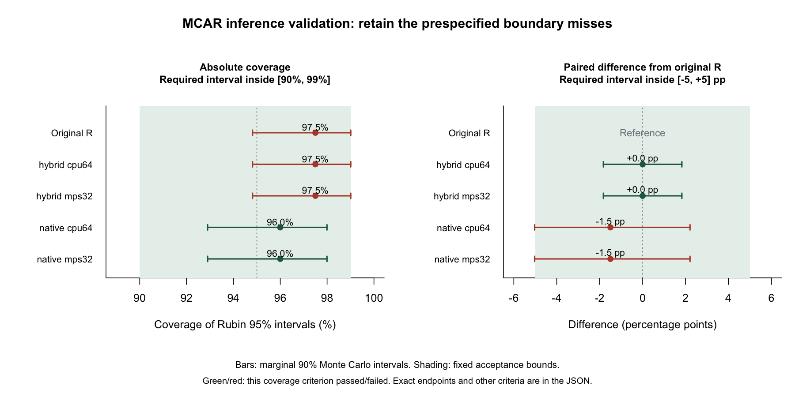

# G5 Mac MPS 正式推断验证：完整执行，统计门槛未全部通过

**五条路线的全部拟合成功；冻结的统计验收标准没有全部通过。** 2026-09-26 按已提交的 [G5 预注册方案](../g5-prespecified/README.md)执行，每路线 MCAR/MAR 各 200 个独立数据集，以及 20 个独立高相关/高缺失压力数据集，`n=300,m=5`。五路线合计 **2,100 次多重插补调用、10,500 次 bootstrap EM 拟合**。没有更换种子、扩大界限、删去失败或追加模拟来改变结论。

MAR 场景五路线全部通过。MCAR 中，原版 R 和两条 hybrid 路线未通过绝对覆盖率界限；native CPU64/MPS32 未通过相对 R 的配对覆盖率界限。两种设备下的结论一致，**不能归因为 GPU 独有的故障，也不能把 G5 勾成整体通过**。

## 实际完成与诊断

| 路线 | 数据集完成/计划 | 拟合收敛/计划 | 最大 EM 轮数 | 拟合 warnings | 伪逆次数 | 正 final empri 的数据集 |
|---|---:|---:|---:|---:|---:|---:|
| 原版 R 1.8.3 | 420/420 | 2,100/2,100 | 28 | 0 | 原版未暴露 | 原版未暴露 |
| hybrid CPU64 | 420/420 | 2,100/2,100 | 28 | 0 | 0 | 0 |
| hybrid MPS32 | 420/420 | 2,100/2,100 | 28 | 0 | 0 | 0 |
| native CPU64 | 420/420 | 2,100/2,100 | 24 | 0 | 0 | 0 |
| native MPS32 | 420/420 | 2,100/2,100 | 24 | 0 | 0 | 0 |

全部已观测单元保留、完成数据有限；没有失败、未收敛、OOM 或缺少计划记录。每路线额外 20 个压力案例均通过拟合质量检查。压力样本没有 coverage/等价门槛，不能由 20 次成功外推高相关数据的普遍推断有效性。原版 R 的内部计数仍记为 null，保留完整 `iterHist`；没有用 0 冒充不可获得的量。

各路线记录的 `process_exit_status` 均为 0：三个 R 子进程正常结束，两个 native 路线在主进程内完整完成；主 driver 在统计判定后返回 **1**。独立审计工具返回 0 表示记录和重算一致，且明确 `all_primary_criteria_passed=false`。这两个退出值含义不同。

## 系数推断结果

目标为 `y ~ 1+x1+x2` 的 x1 系数，真值 1。以下为每场景 200 次的结果；覆盖率指每次 Rubin **95%** 区间的覆盖率。表中显示精度会隐藏很小的 CPU/MPS 差异，完整数值保存在 JSON。MCSE 是独立模拟误差，不是回归系数的标准误。

| 路线 | 场景 | 偏差 | 偏差 MCSE | 覆盖率 | 覆盖率 MCSE，百分点 | 平均 pooled SE | 平均区间宽度 |
|---|---|---:|---:|---:|---:|---:|---:|
| 原版 R | MCAR | −0.001053 | 0.004600 | 97.5%（195/200） | 1.104 | 0.067563 | 0.268364 |
| hybrid CPU64 | MCAR | −0.001053 | 0.004600 | 97.5%（195/200） | 1.104 | 0.067563 | 0.268364 |
| hybrid MPS32 | MCAR | −0.001053 | 0.004600 | 97.5%（195/200） | 1.104 | 0.067563 | 0.268364 |
| native CPU64 | MCAR | −0.000688 | 0.004679 | 96.0%（192/200） | 1.386 | 0.066854 | 0.265049 |
| native MPS32 | MCAR | −0.000688 | 0.004679 | 96.0%（192/200） | 1.386 | 0.066854 | 0.265049 |
| 原版 R | MAR，y 观测 | 0.001829 | 0.004871 | 95.5%（191/200） | 1.466 | 0.068073 | 0.270905 |
| hybrid CPU64 | MAR，y 观测 | 0.001829 | 0.004871 | 95.5%（191/200） | 1.466 | 0.068073 | 0.270905 |
| hybrid MPS32 | MAR，y 观测 | 0.001829 | 0.004871 | 95.5%（191/200） | 1.466 | 0.068073 | 0.270905 |
| native CPU64 | MAR，y 观测 | 0.002905 | 0.004810 | 97.0%（194/200） | 1.206 | 0.068556 | 0.273081 |
| native MPS32 | MAR，y 观测 | 0.002905 | 0.004810 | 97.0%（194/200） | 1.206 | 0.068556 | 0.273081 |

每项平均 pooled SE、区间宽度的 MCSE 和 90% 区间、完整 paired MCSE 都在 [独立汇总](summary.json) 中。Pooling 与先前初筛一致，使用 Rubin 有限 m 的 t 自由度，未用 Barnard–Rubin 有限完整样本修正。

## 哪些门槛没有通过

预定要求是 **90% Monte Carlo 区间完整位于界限内**，不是只要求点估计处于界限内，也不是“不显著即可等价”。

1. **原版 R / hybrid CPU64 / hybrid MPS32 的 MCAR 绝对覆盖率**：195/200 的精确 90% 区间为 **[94.815666%, 99.009876%]**；上端超过预设 99% 上界约 **0.009876 个百分点**。所以原版参考自身也未通过。点估计 97.5% 不是低覆盖率问题，此结果说明本轮区间未能完全排除既定界限外的值；不能据此宣布原版或 GPU 算法错误。
2. **native CPU64 / native MPS32 的 MCAR 配对覆盖率差**：相对 R 为 **−1.5 个百分点**；200 对里有 1 对仅 native 覆盖、4 对仅 R 覆盖。配对差 MCSE 为 **1.115784 个百分点**；两种 discordance 的精确区间加 union bound 得到保守 90% 区间 **[−5.028703, +2.206633] 个百分点**，下端超过预设 −5 个百分点约 **0.028703 个百分点**。不能事后把界限改为 ±5.03 来过关。

所有偏差、配对系数差、SE 比值、区间宽度比值检查均通过；hybrid 的配对覆盖率差也通过。MAR 所有绝对和配对检查通过。native 与 R 使用不同 RNG，所以 native 的配对差同时包含随机实现差异；native MPS 与 CPU 得到同样的边界结论，不支持将其解释为 GPU 精度造成的单独失败。

即使越界很小，也保留原始未通过状态。此结果既不是普遍统计无效的证明，也不够支持“预设验收全部通过”。此目录没有执行任何补充模拟。



图中红色表示对应覆盖率检查未通过；区间接近边界时需看上面的精确数值。[PDF](mcar-coverage.pdf) 可用于分享，复现命令：`Rscript scripts/plot_inference_summary.R docs/validation/2026-09-26-g5-mps/summary.json docs/validation/2026-09-26-g5-mps`。绘图不重新拟合或改变判定。

## R 同随机流下的差异

R/reference 与 hybrid 使用相同映射种子及 `L'Ecuyer-CMRG / Inversion / Rejection`；native 保留原 uint32 seed 和 PCG64。全部输入哈希和 seed 映射已重建核验。

- hybrid CPU64 相对原 R 的 pooled x1 系数最大绝对差：400 个主场景中 `2.3315e-15`，20 个压力中 `2.7978e-14`；所有逐份 EM 轮数相同。
- hybrid MPS32 的相应最大绝对差：主场景 `4.5024e-7`，压力 `4.3418e-5`。`mcar-189` 的第 1 份拟合由 6 轮变为 7 轮；`stress_mcar-000` 的第 3 份由 15 轮变为 16 轮。保留这些 float32 差异，不称逐位一致。
- 两条 hybrid 在两个主场景均与 R 有完全相同的覆盖/未覆盖分类。其配对覆盖率差的保守 90% 区间仍为 `[-1.827534,+1.827534]` 个百分点，**没有因为零 discordance 就把不确定性写成零**。

只保存了每份回归 q/U、pooling、EM 诊断及拟合时质量检查，未保存全部完成矩阵。因此审计独立重算的是输入/种子、回归层统计量及完整性；观察值保留/有限性来自拟合时对完整输出的逐份检查，不冒充事后从完整矩阵再次重算。

## 环境、复现与证据

实际环境：macOS 26.6.2、arm64，Python 3.12.13、NumPy 2.5.3、Torch 2.14.0，R 4.5.3、Amelia 1.8.3。所有 BLAS 环境变量与 Torch 设为 1 线程，`PYTORCH_ENABLE_MPS_FALLBACK=0`。MPS 的显式 CPU 特征值诊断仍在逐份 metadata 中，不能把 fallback=0 叫作纯 GPU。

运行 UTC：2026-09-26 22:17:49 至 22:36:26。约 18.6 分钟的总验证成本含持续 checkpoint 等工作，只用于确认预算，不作速度比较。本轮在本机 G7 计时全部结束后执行，拟合期间所跟踪源码哈希没有变化。

```sh
OPENBLAS_NUM_THREADS=1 OMP_NUM_THREADS=1 MKL_NUM_THREADS=1 \
VECLIB_MAXIMUM_THREADS=1 PYTORCH_ENABLE_MPS_FALLBACK=0 \
  .venv/bin/python scripts/validate_inference_suite.py --mode formal \
  --routes r-reference hybrid-cpu64 hybrid-mps32 native-cpu64 native-mps32 \
  --time-budget-seconds 7200 --output results/local/g5-mps-formal-new

.venv/bin/python scripts/summarize_inference_suite.py \
  results/local/g5-mps-formal-new/inference-suite.json \
  --output results/local/g5-mps-audit-new
```

第二条命令在与生成时相同的 NumPy/BLAS 环境执行，以便重新生成输入后进行逐字节 SHA 检查；跨平台浮点库差异不应被误叫作篡改。脚本拒绝覆盖旧目录。观察到门槛未过后不要删除旧结果重跑选优。

- [独立汇总](summary.json)：逐路线数量、诊断、MCSE、完整 90% 区间和每项判定；审计通过不等于统计标准通过。
- [完整逐次报告，gzip](inference-suite.json.gz)：解压后包含全部 2,100 条记录、420 份输入来源、种子、逐份回归与 EM 诊断、版本/协议/源码哈希。原 JSON 为 **16,027,250 字节**，SHA-256 **`3ad4e3de9892e0a1e69512fc0330778ded622e45a70e9604cdf1390328ccb57c`**。
- [运行源码快照](measured-source.zip)：16 个被记录源文件的内容均与 report SHA 匹配，另附 LICENSE 与 THIRD_PARTY；不含本地配置、完整原始日志、凭据或合成输入二进制。
- [产物哈希](sha256.json)：压缩报告、源码包、汇总的 SHA-256 与字节数；gzip 解压、ZIP CRC 和逐源文件哈希已复核。公开 JSON 已做私人路径/邮箱扫描。

协议 SHA-256 保持 **`7ea7882bccc8d92102a67786bc9c09c2055ce29d97350abfbcf4f74f2187e454`**，此前已入提交 `06b0fe8`。独立审计的 9 项测试覆盖 pooled 结果篡改、错误覆盖标记、非有限方差、超界宽度比，以及真实历史/backend 证据，均通过。本次没有修改共享 release-gates 或将 G5 标为完成。
