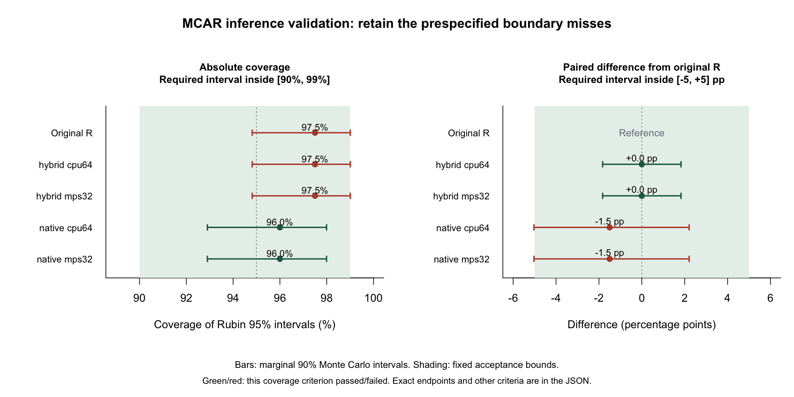

# Mac G5 inference results

[简体中文](README.zh-CN.md) · [Documentation](../../README.md)

**Execution complete; statistical criteria not all passed.** On 2026-09-26, five routes each ran 200MCAR+200 MAR+20 stress datasets, n=300/m=5:2,100 calls/10,500 fits. All converged, preserving observations and finite required outputs, with no failures, OOM or fit warnings. Hybrid/native reported no pseudoinverse or positive final empri; original internal counts remain null. Maximum iterations were 28 for R/hybrid, 24 for native.

All MAR criteria and bounded stress validity checks passed. MCAR absolute coverage failed for original R and both hybrids; paired coverage failed for native CPU64/MPS32. CPU/MPS classifications agree; this is not evidence of a GPU-only defect. Route execution statuses were 0; the driver returned 1 for statistical criteria. Independent audit exit 0 means records/recalculation agree, not acceptance.

| Route family | MCAR bias / coverage | MAR bias / coverage |
|---|---|---|
| Original R / hybrid CPU64 / hybrid MPS32 |−.001053 /195 of 200 (97.5%)|.001829 /191 of 200 (95.5%)|
| Native CPU64 / native MPS32 |−.000688 /192 of 200 (96%)|.002905 /194 of 200 (97%)|

Displayed rounding hides small device differences. All SE, width, MCSE and per-route values are retained in summary.json. Rubin finite-m t pooling is used, without Barnard–Rubin.

## Failed criteria

Original R/hybrid MCAR exact 90% coverage interval is **[94.815666%, 99.009876%]**, exceeding the 99% upper limit by 0.009876 percentage points. This is not low point-estimate coverage or proof of an algorithm defect.

Native paired coverage difference versus R is −1.5 percentage points: one native-only and four R-only covered pairs. MCSE 1.115784 pp; the conservative 90% discordance interval **[−5.028703,+2.206633] pp** exceeds the −5 bound by 0.028703 pp. No margin was changed. Other bias, paired coefficient, SE/width checks passed, as did hybrid paired coverage. Native/R have different RNG implementations; successful fits alone cannot close G5.

## Paired outputs and records

Inputs and seed mapping were reconstructed. Hybrid CPU64 maximum pooled coefficient differences vs R were 2.3315e−15 across 400 primary datasets and 2.7978e−14 across 20 stress cases; all fit iteration counts matched. MPS32 differences were 4.5024e−7/4.3418e−5. Two iterations differed: mcar-189 first fit 6→7, stress_mcar-000 third 15→16. Hybrid coverage classifications matched R, but zero discordance still gave interval [−1.827534,+1.827534] pp, not zero uncertainty.

Only per-fit regression q/U, pooling, EM and fit-time quality checks were retained, not all completed matrices. Offline audits recalculate recorded statistics; they do not independently reread full outputs for observation checks.

Mac 26.6.2 arm64/Python 3.12.13/NumPy 2.5.3/Torch 2.14.0/R 4.5.3/Amelia 1.8.3 used one-thread budgets and MPS fallback 0 with explicit CPU eigenvalue checks. UTC 22:17:49–22:36:26, about 18.6 minutes including checkpoints; not a speed comparison. Source guards held after G7 timing ended. The 16,027,250-byte raw JSON hash is `3ad4e3de9892e0a1e69512fc0330778ded622e45a70e9604cdf1390328ccb57c`. Source ZIP has 16 matched files plus attribution. Frozen protocol remains `7ea7882bccc8d92102a67786bc9c09c2055ce29d97350abfbcf4f74f2187e454`; nine audit tests passed. No supplemental simulation was run.

Input hash regeneration requires matching NumPy/BLAS; cross-platform floating differences are not automatically tampering. Use fresh output directories for any separately scheduled replication.



## Records

This report describes the dated run and measured source below. Later project status is recorded in the [evidence summary](../2026-09-27-evidence-summary.md).

[summary.json](summary.json) · [mcar-coverage.png](mcar-coverage.png) · [mcar-coverage.pdf](mcar-coverage.pdf) · [inference-suite.json.gz](inference-suite.json.gz) · [measured-source.zip](measured-source.zip) · [sha256.json](sha256.json)

```sh
OPENBLAS_NUM_THREADS=1 OMP_NUM_THREADS=1 MKL_NUM_THREADS=1 \
VECLIB_MAXIMUM_THREADS=1 PYTORCH_ENABLE_MPS_FALLBACK=0 \
  .venv/bin/python scripts/validate_inference_suite.py --mode formal \
  --routes r-reference hybrid-cpu64 hybrid-mps32 native-cpu64 native-mps32 \
  --time-budget-seconds 7200 --output results/local/g5-mps-formal-new

.venv/bin/python scripts/summarize_inference_suite.py \
  results/local/g5-mps-formal-new/inference-suite.json \
  --output results/local/g5-mps-audit-new
```
