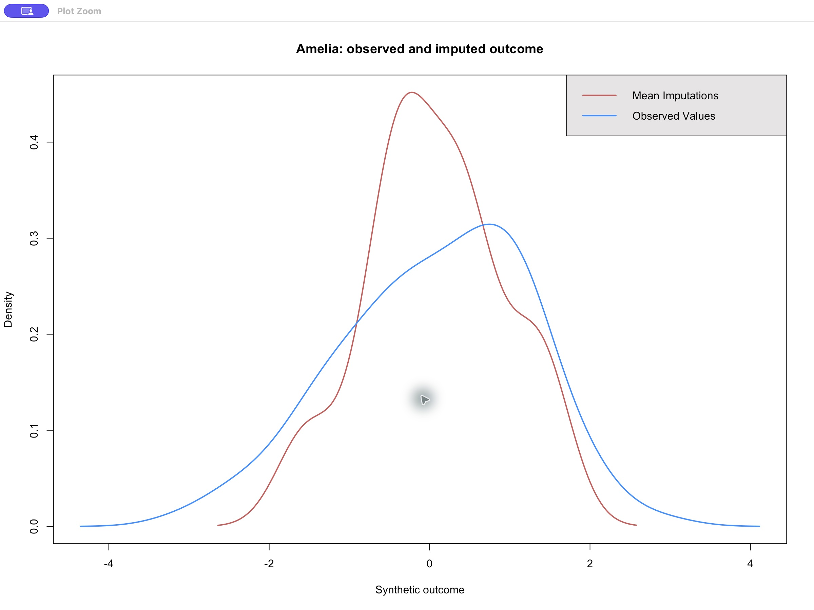

# G6：实际 RStudio 会话验收

2026-09-26，在 macOS arm64 的 **RStudio 2026.1.1.403** 实际会话中，已安装的 reference 与 hybrid CPU64 路线完成数据框插补、解释器核对、结果保存/读回、Data Viewer 展示和诊断图视觉检查。此记录关闭 G6 中这一个有限的 RStudio 用户流程；不代表 AmeliaView、其他系统的交互式 GUI、GPU 质量或完整首版已经验收。

## 实际执行与结果

环境为 R 4.5.3、Amelia **1.8.3**、ameliatorch 0.0.0.9000、Python 3.12、Torch 2.14.0。RStudio 中选择的解释器与项目 `.venv/bin/python` 精确一致，没有解析成虚拟环境之外的符号链接目标。完整的脱敏机器报告见 [session.json](session.json)。

固定种子生成 120 行、4 列合成数据，含一个 ID 和三个连续变量；每条路线产生 3 份插补。reference 与 hybrid 使用相同 R seed 871，均返回 code 1，逐份结果在预定 `all.equal(tolerance=1e-6)` 下相符。全部应补值有限，已观测值精确保留；hybrid 三份分别在 7、9、6 轮收敛，伪逆计数均为 0。

| 用户操作 | 实际结果 |
|---|---|
| 已安装包调用、解释器检查 | 通过；使用项目 venv 和 CPU float64 |
| 两条路线 RDS 保存并读回 | 与原对象 `identical`，通过 |
| 第一份完成数据 CSV 保存并读回 | `all.equal(tolerance=1e-12)`，通过 |
| RStudio Data Viewer | 显示 12 行、4 列合成完成数据 |
| `Amelia::compare.density` | 在 `RStudioGD` / Plots 面板实际绘制 |
| Plot Zoom 视觉检查 | 标题、坐标轴、红/蓝曲线及图例完整可见 |
| 用户现有工作 | 原编辑标签及未保存修改保留；未清空/保存 workspace、未更改工作目录 |

原始 [session.json](session.json) 在人工视觉检查之前生成，因此其中 `plot_visual_review` 的 Pending 文本**原样保留**。后续真实检查见 [independent-visual-review.json](independent-visual-review.json)，执行细节和失败历史见 [review.json](review.json)。可见控制台还显示了 `G6 RSTUDIO PASS`；下面的公开截图仅包含图形窗口，不包含用户源代码标签或私有路径。



`rstudio-plot-ui.jpg` 是未经修改的实际 GUI 截图（JPEG，2400×1800），SHA-256 为 `d97916eed48ec1449295268737d90d2a7a017c4df5aad2b7db51450453f7f371`。[diagnostic.png](diagnostic.png) 是 R 导出的图形文件，二者用途不同，PNG 不作为 GUI 视觉验收的替代。

## 复现与来源

先按项目安装说明安装 R 包及 Python 环境，在实际 RStudio 会话中运行：

```r
local({
  project_root <- normalizePath("path/to/amelia-torch", mustWork = TRUE)
  e <- new.env(parent = globalenv())
  sys.source(file.path(project_root, "scripts", "rstudio_smoke.R"), envir = e)
  e$run_rstudio_smoke(project_root)
})
```

将占位路径替换为本地 checkout。脚本将六个输出文件写入 `results/local/g6-rstudio/`；若这些同名文件已经存在，它会明确停止，不覆盖。重复执行前只归档本测试自身的输出。脚本要求真实 RStudio 交互式会话，不能用 Rscript 的执行成功替代 GUI 验收。

公开 [input.csv](input.csv) 和 [completed.csv](completed.csv) 只含本脚本生成的合成数据。RDS 可能带有调用表达式或环境信息，保留在本地，不随此报告公开；其校验哈希记录在 `review.json`，可用脚本重新生成。

实际执行脚本的精确副本是 [executed-rstudio-smoke.R](executed-rstudio-smoke.R)，SHA-256 为 `1e66f712a651c8c5e4c48a3cd5aa2e5806337de6847552993c3444b1a40f15e7`。执行后审查只收紧了 [当前脚本](../../../scripts/rstudio_smoke.R) 的退出清理顺序：先恢复 Torch 线程数，最后恢复两层 R RNG 状态。该清理调整已通过 R 语法解析，**没有再次运行 GUI**；拟合、对照、导出和绘图代码均未改变。当前与已执行源码的哈希分别记录，避免把未重跑的修改冒称已执行。

首次尝试在拟合、保存/读回和绘图之后，因为测试助手显式调用 `utils::View` 而请求了缺失的 X11 数据编辑器。改为调用 RStudio 会话的 `View` 后，完整流程重新执行并通过。第一次的合成产物在本地归档。这是测试助手的集成错误，**不是插补包或 RStudio 图形算法的缺陷**；正常 RStudio Data Viewer 和本次图形显示没有依赖 XQuartz。

独立的包级回归范围见 [235 项 Python / 九个 R 文件及包检查记录](../2026-09-26-regression/README.md)，不与本次单个 GUI 例子合并计数。本目录的可公开文件及源码哈希见 [SHA256SUMS.json](SHA256SUMS.json)。

## 原版 AmeliaView：尚未运行

AmeliaView 是原版 R/Tcl/Tk GUI，仍走原版 CPU。它的启动、载入、关闭均**未验证**，不由以上 RStudio 成功替代。当前状态和官方安装包来源见 [xquartz-prerequisite.json](xquartz-prerequisite.json)：

- 缺少 R Tcl/Tk 所需的 XQuartz 库。官方 XQuartz 2.8.6 包已下载，哈希、Apple 开发者签名和公证校验通过。安装步骤因需要管理员认证而停止；这项 `sudo` 失败不是自动审批拒绝。
- 随后的 AmeliaView 启动请求在执行前被自动审批拒绝，理由是早前的临时 no-GUI 限制及依赖缺失导致的挂起风险。该请求没有执行，也没有绕过拒绝。
- 原生 Installer 连接没有返回可观察的窗口，等待约 2266.7 秒后由父 Agent 中断；工具返回 `aborted by user`，不代表用户本人亲自操作了中止。因此无法确认安装器是否打开或处于认证页面，不能记作已准备好管理员窗口。

未输入/收集密码、未接受法律协议、未注销或重启。后续需先确认依赖安装完成，再单独完成官方 AmeliaView 的启动/载入/关闭检查；当前记录仅确认 RStudio 工作流。
