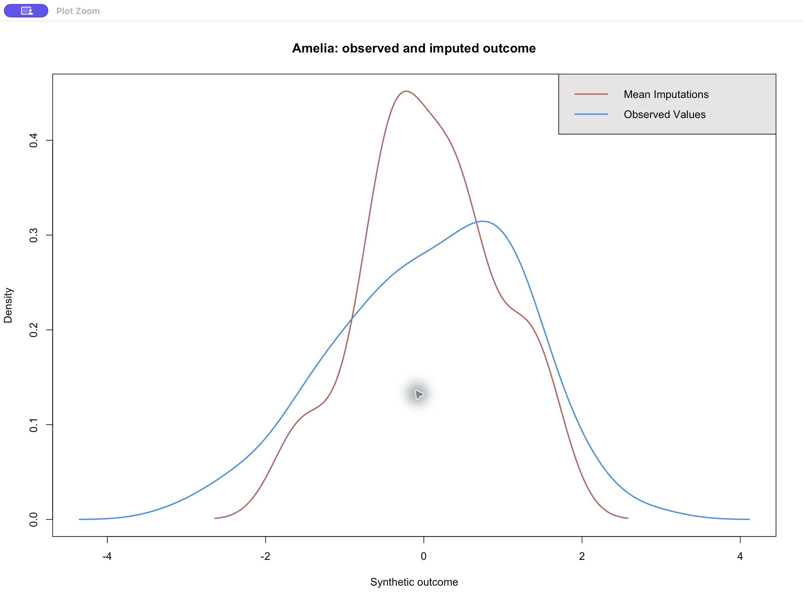

# G6 Mac RStudio workflow

[简体中文](README.zh-CN.md) · [Documentation](../../README.md)

On 2026-09-26, an actual RStudio 2026.1.1.403 session on Mac arm64 exercised installed reference/hybrid CPU64 imputation, interpreter selection, saving/readback, Data Viewer and visual plot inspection. This covers one bounded interactive workflow, not AmeliaView, other platforms or GPU/inference acceptance.

R 4.5.3/Amelia 1.8.3/ameliatorch 0.0.0.9000/Python 3.12/Torch 2.14.0 used the exact project-venv interpreter without resolving its symlink outside the environment. Synthetic 120×4 data contained an ID and three continuous variables; each route produced m=3 with R seed 871. Both returned code 1 and matched at preselected all.equal 1e−6; observations were exact and required fills finite. Hybrid iterations 7/9/6, pseudoinverses 0.

RDS readback was identical; first-imputation CSV matched at 1e−12. Data Viewer displayed 12×4 cells. compare.density rendered in RStudioGD/Plots, and Plot Zoom showed title, axes, red/blue curves and legend. Existing session work was preserved. The original session.json predates visual inspection and retains Pending; independent-visual-review.json records the later inspection.



The unchanged 2400×1800 JPEG screenshot hash is `d97916eed48ec1449295268737d90d2a7a017c4df5aad2b7db51450453f7f371`. diagnostic.png is an exported plot, not substitute GUI evidence. Published CSVs are synthetic; RDS stays local because expressions/environment metadata may contain paths.

The executed script copy hash is `1e66f712a651c8c5e4c48a3cd5aa2e5806337de6847552993c3444b1a40f15e7`. Later cleanup-order tightening (restore Torch threads before both RNG states) received syntax checking only, not a GUI rerun; source identities remain separate. The first attempt used utils:: View, invoking unavailable X11; replacing it with RStudio's View allowed the complete workflow to pass. This was a helper integration failure, not an imputation or RStudio graphics defect.

For replication, use the following inside an actual RStudio session. Replace the placeholder checkout path; existing six output files under results/local/g6-rstudio cause refusal rather than overwrite.

```r
local({
  project_root <- normalizePath("path/to/amelia-torch", mustWork = TRUE)
  e <- new.env(parent = globalenv())
  sys.source(file.path(project_root, "scripts", "rstudio_smoke.R"), envir = e)
  e$run_rstudio_smoke(project_root)
})
```

## AmeliaView boundary

Original AmeliaView remains an R/Tcl/Tk CPU GUI with no validated launch/load/close. XQuartz dependencies were absent. The official 2.8.6 installer was downloaded and signature/hash/notarization checked, but installation was not confirmed. No successful GUI launch or ready authentication window is recorded. These prerequisites and unsuccessful setup attempts are retained in xquartz-prerequisite.json; they do not qualify as GUI acceptance. Normal RStudio Data Viewer and the plot above did not require XQuartz.

## Records

This report describes the dated run and measured source below. Later project status is recorded in the [evidence summary](../2026-09-27-evidence-summary.md).

[session.json](session.json) · [independent-visual-review.json](independent-visual-review.json) · [review.json](review.json) · [rstudio-plot-ui.jpg](rstudio-plot-ui.jpg) · [diagnostic.png](diagnostic.png) · [input.csv](input.csv) · [completed.csv](completed.csv) · [executed-rstudio-smoke.R](executed-rstudio-smoke.R) · [rstudio_smoke.R](../../../scripts/rstudio_smoke.R) · [SHA256SUMS.json](SHA256SUMS.json) · [xquartz-prerequisite.json](xquartz-prerequisite.json)
