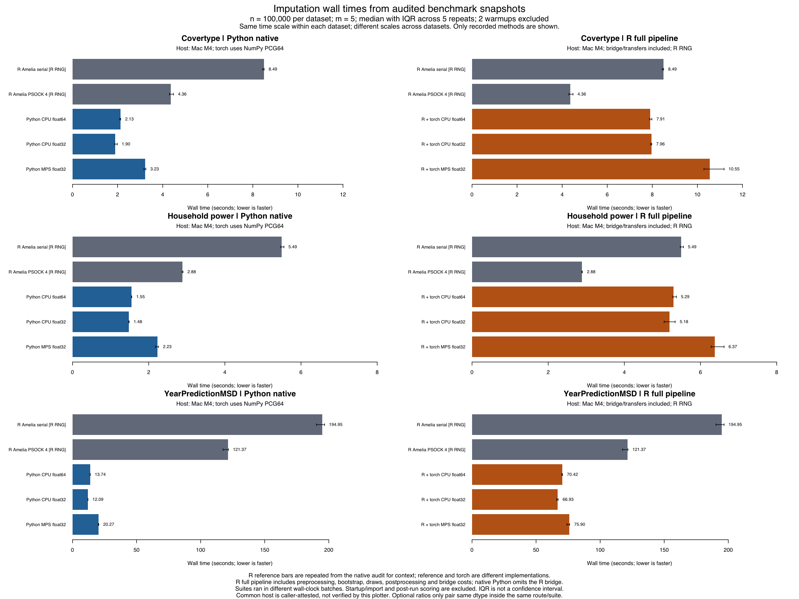

# 已审计性能结果的图形化呈现

此目录把 2026-09-23 已审计的 Mac M4 三数据集结果画成同一视图；没有重新拟合或更新计时。每组数据使用 100,000 行数值子集、m=5、两次预热与五次正式重复，柱为中位数、误差线为 IQR，并非置信区间。



左侧为 Python native 与原版 R 基线，右侧为包含 R 桥接的完整 R 流程；原版柱在右侧重复展示作为参考。同一数据集使用相同时间轴，不跨机器、不同精度或不同产品路线计算 GPU 收益。当前六个同精度 CPU32/MPS32 比值均小于 1，即 MPS 更慢；这不代表 CUDA 的结果。Python 与原版 R 使用不同的随机数库和实现，不能将二者差异全部归因于 GPU。

来源、全部重复、质量检查与测量限制见[原始开发报告](../2026-09-23-development/README.md)。完整数据表、图形生成元数据和 SHA-256 同目录保留；绘图器检查已审计输入的完整性，但不自行认证机器身份或重做统计审计。`--same-host` 依据本次两份 Mac 报告的实测来源明确声明，不能仅凭参数推断同机。

复现（在项目根目录运行，使用一个新输出前缀）：

```sh
Rscript scripts/plot_audited_performance.R \
  --native docs/validation/2026-09-23-development/benchmark-summary-audit-v2.json \
  --hybrid docs/validation/2026-09-23-development/hybrid-summary.json \
  --native-host 'Mac M4' --hybrid-host 'Mac M4' --same-host \
  --output-prefix results/local/figures/mac-audited
```

脚本仅读取报告，不加载或拟合 Amelia。PNG/PDF 已实际生成并目视检查，八项有限输入/标签/声明检查通过；本机 SVG 设备不可用，未把 SVG 标为产物。下载矢量版本：[PDF](mac-final.pdf)。
