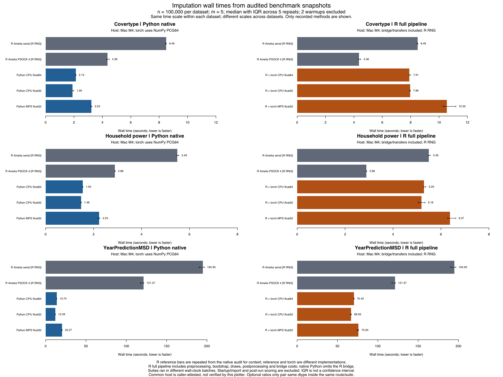

# Mac performance figures

[简体中文](README.zh-CN.md) · [Documentation](../../README.md)

Figures use the already audited 2026-09-23 M4 data, without refitting or retiming: three 100k-row numeric subsets, m=5, two warmups/five measured repeats. Bars are medians, error bars IQR, not confidence intervals.



Left panels show nativePython and original R; right panels show full R hybrid calls including the bridge, with repeated R baselines. Each dataset shares its time axis. All six same-precision CPU32/MPS32 ratios are below 1: MPS was slower. This does not establish CUDA behavior. Python/R differences combine implementations and RNG libraries.

The plotter checks audited input completeness, not host identity or statistical validity. `--same-host` reflects the reports' verified provenance, not evidence created by an option. PNG/PDF were generated and visually inspected; eight bounded input/label checks passed. SVG was unavailable and is not claimed. Source tables, metadata and hashes are retained; use a new prefix to reproduce.

## Records

This report describes the dated run and measured source below. Later project status is recorded in the [evidence summary](../2026-09-27-evidence-summary.md).

[mac-final.png](mac-final.png) · [mac-final.pdf](mac-final.pdf)

```sh
Rscript scripts/plot_audited_performance.R \
  --native docs/validation/2026-09-23-development/benchmark-summary-audit-v2.json \
  --hybrid docs/validation/2026-09-23-development/hybrid-summary.json \
  --native-host 'Mac M4' --hybrid-host 'Mac M4' --same-host \
  --output-prefix results/local/figures/mac-audited
```
