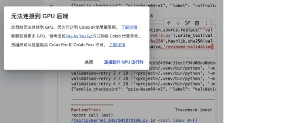

# Colab 重启、环境失败与暂停记录

**用户因 Colab GPU 配额耗尽而暂停新增测试；此包只保存已经产生的记录，不构成新的 CUDA 验收通过。** 在旧性能 VM 丢失后，替代会话使用固定算法源码 `ef729c093e162f4d6ebd797c95a9da8072ac968a`；未把新会话的数据拼入旧性能实验。

使用的公开模板来自 `b4f0b14683e4e92cfb43ccd91a40cf95746fecba`，文件 SHA-256 为 `aa10c6c58db14c0cc851e1ce36f19791057665b1b2498cef767098cef6e83ae3`。实际只执行了初始化、安装计划、安装与正确性阶段；它不是模板从头到尾的成功运行。下列安装修复与重试都是独立目录，保留旧失败。

| 已执行阶段 | 实际结果 |
|---|---|
| 安装计划 | 完成，固定 Amelia 1.8.3 及归档哈希 |
| 首次安装 | 失败。apt 将 R 升至 4.6.1；预装 Rcpp 头文件及 vctrs 二进制不兼容，出现 `R_NamespaceRegistry` / `SETLENGTH` 错误 |
| 恢复 R 基线 | 官方 CRAN apt 的 4.5.3-1.2204.0；预检仅四个 R 包降级、无包移除；新装失败库改名保留，建立空的项目 R 库 |
| 安装重试 | 不再运行系统升级，安装记录为 passed；算法源码不变 |
| 第一轮验证 | CUDA 探针和 Ruff 版本读取通过；Ruff 0.15.8 对动态加载后的测试导入报 E402，因此停止 |
| Ruff 对齐 | 仅在项目 venv 安装官方 PyPI Ruff 0.16.8，与本机通过版本一致；未忽略 lint 规则或改被测算法 |
| 第二轮验证 | 探针、版本、lint 通过；pytest **306 passed、1 failed**，随后停止；九个 R 测试文件、后续 CUDA 边界与 G5 尚未执行 |

失败用例是 `test_unicode_space_python_and_r_library_paths_execute_actual_hybrid`。临时创建的含中文/空格路径解释器在 `import numpy` 时出现 `ModuleNotFoundError`，尚未调用该例的插补函数。测试代码只传递项目的 purelib 路径，而当前 Colab venv 使用共享依赖；这是后续需要处理的测试环境缺口，**没有修复后重测，不能标成已解决**。其他 306 项测试实际执行过，不把整轮描述成完全未运行，也不把部分通过称为整套通过。

Ruff 的测试导入写法已在后续本地修改，相关 49 项测试在用户暂停之前通过；该修改未用于这里的固定 `ef729c0` 云端记录。R 安装保护的新实现仍是未验收的本地草稿，不作为本包的成功修复发布。原安装器的问题仍需在恢复开发时处理。Rcpp 对 R 4.6 API 的适配亦有[上游记录](https://github.com/RcppCore/Rcpp/issues/1468)，本次故障判断以归档内实际编译日志为准。

## 留存范围

七个可恢复 checkpoint 的哈希和阶段结果见 [recovery-summary.json](recovery-summary.json)。[recovered-stage-records.tar.gz](recovered-stage-records.tar.gz) 包含 **54 个已恢复文本文件**，归档大小 79,449 bytes，SHA-256：

```text
8cdf7a06e01a5eac4212edd5490eda119246343aad84604977c6d81ba2a3acee
```

每个阶段保留独立的 checkpoint manifest、日志和退出状态；[archive-index.json](archive-index.json) 列出每个 payload 的大小及哈希。打包后逐文件读回与恢复字节一致。原始 checkpoint envelope 另存本地；公开归档采用恢复后的可读记录，规范化容器时间和所有者，没有把失败改成通过。



截图在用户要求暂停时取得，没有账号身份信息。它证明当时无法取得 GPU；**不能据此反推更早的旧 VM 丢失原因或最后一个 Year CUDA32 的结局**。未购买算力，未切换 CPU 运行时继续实验，未启动额外 1,000 次 MCAR。

有限文本隐私检查见 [privacy-review.json](privacy-review.json)，全部公开文件校验见 [SHA256SUMS.json](SHA256SUMS.json)。数据汇总结论另见[阶段总结](../2026-09-27-evidence-summary.zh-CN.md)。
